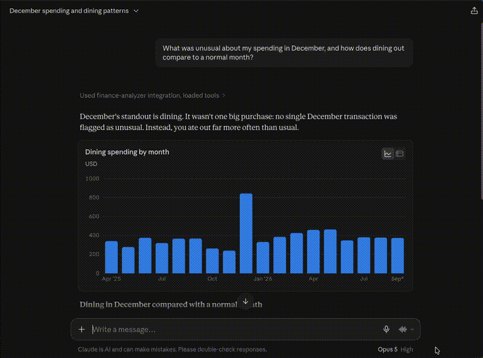

# Personal Finance Analyzer (MCP Server)


An [MCP](https://modelcontextprotocol.io) server that turns a transactions CSV into a set of
analysis tools an LLM can call directly. Ask "what was unusual about my December spending?" in
Claude Desktop and the model plans the analysis itself, calling whichever tools it needs.

Built with the MCP Python SDK and pandas.

## Why this exists

Handing an LLM a raw CSV means it either guesses or burns context re-reading the file. This
server exposes a small set of purpose-built aggregations instead, so the model gets grounded
numbers back, and the statistical work (z-scores, period comparisons, pivots) happens in pandas
rather than in the model's head.

## Tools

| Tool | What it does |
| --- | --- |
| `dataset_overview` | Date range, row count, categories, totals. Orients the model before it queries. |
| `spending_by_category` | Totals per category with share of spend and average transaction size. Optional date bounds. |
| `monthly_trend` | Month-by-month totals with percent change, overall or for one category. |
| `top_merchants` | Merchants ranked by spend, optionally within a category. |
| `detect_anomalies` | Per-category z-score outlier detection, so a large grocery run isn't judged against a coffee baseline. |
| `category_month_matrix` | Category-by-month pivot table for multi-slice comparisons. |

## Quick start

```bash
git clone <your-repo-url> && cd finance-analyzer
python3 -m venv .venv && source .venv/bin/activate   # Windows: .venv\Scripts\activate
pip install -r requirements.txt

python generate_sample_data.py     # writes 18 months of realistic fake transactions
mcp dev server.py                  # opens the MCP Inspector to try the tools
```

## Connect to Claude Desktop

Add this to `claude_desktop_config.json`, using absolute paths:

- macOS: `~/Library/Application Support/Claude/claude_desktop_config.json`
- Windows: `%APPDATA%\Claude\claude_desktop_config.json`

```json
{
  "mcpServers": {
    "finance-analyzer": {
      "command": "/ABSOLUTE/PATH/finance-analyzer/.venv/bin/python",
      "args": ["/ABSOLUTE/PATH/finance-analyzer/server.py"],
      "env": {
        "TRANSACTIONS_CSV": "/ABSOLUTE/PATH/finance-analyzer/transactions.csv"
      }
    }
  }
}
```

Restart Claude Desktop. The tools appear under the search-and-tools icon.

## Data format

| column | notes |
| --- | --- |
| `date` | `YYYY-MM-DD` |
| `merchant` | free text |
| `category` | free text; whatever categories you use are discovered at runtime |
| `amount` | positive = money out, negative = money in (income, refunds) |

To use real data, export a CSV from your bank, rename the columns to match, and point
`TRANSACTIONS_CSV` at it. Nothing leaves your machine except what the model asks for.

## Design notes

**Tools are aggregations, not raw access.** There is deliberately no `run_sql` or `read_rows`
tool. Each tool answers a class of question and returns a compact, pre-computed result, which
keeps responses grounded and cheap in tokens.

**`dataset_overview` exists to prevent guessing.** Without it the model invents category names
and date ranges. The server's `instructions` field tells it to call this first.

**Errors are returned, not raised into the void.** A missing file or bad column produces a
message the model can read and relay, so the user learns what to fix.

**Nothing writes to stdout.** The stdio transport carries JSON-RPC on stdout; a stray `print()`
corrupts the stream and kills the server. All human-facing logging goes to stderr.

## Possible extensions

- Recurring-charge detection (flag subscriptions by interval regularity)
- Simple forecasting of next month's spend per category
- A `resource` exposing the raw CSV for clients that prefer to read it directly

## Requirements

Python 3.10+, `mcp[cli]`, `pandas`.